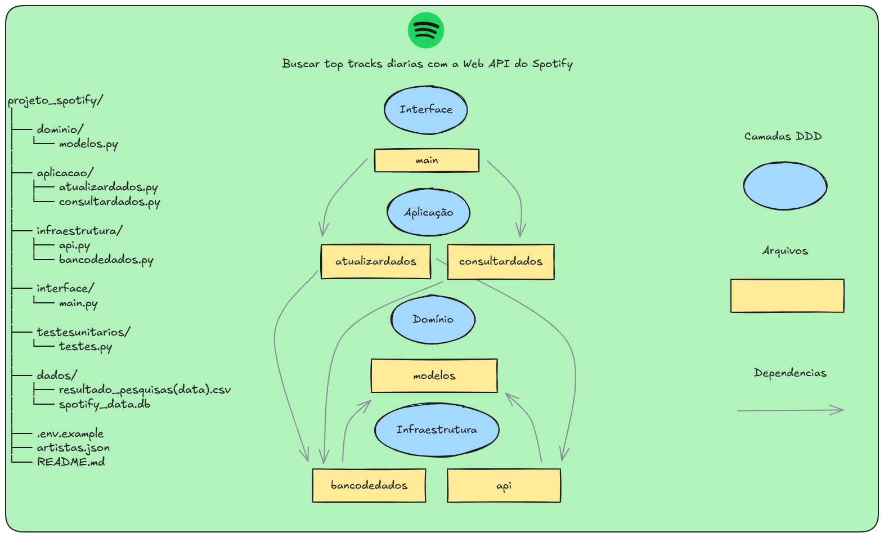

# Spotify Top Tracks CLI

Este projeto realiza a coleta, atualização e consulta de dados de artistas e suas top tracks do Spotify, salvando os resultados em banco de dados SQLite e arquivos CSV. A consulta pode ser feita por nome ou ID do artista, retornando as músicas mais populares do dia mais recente.

## Funcionalidades

- Busca e atualização automática dos dados dos artistas via API do Spotify.
- Armazenamento dos dados em banco SQLite e CSV.
- Consulta de artistas e suas top tracks por nome ou ID (case-insensitive), ordenadas por popularidade.
- Retorno estruturado em formato JSON, pronto para uso em APIs ou análise.

## Arquitetura do Projeto



## Pré-requisitos

- Python 3.10+
- [Spotify Developer Account](https://developer.spotify.com/) para obter Client ID e Secret
- Instalar dependências:
  ```sh
  pip install sqlalchemy requests python-dotenv coverage
  ```

## Configuração

1. **Variáveis de ambiente:**  
   Copie `.env.example` para `.env` e preencha com suas credenciais do Spotify.

2. **Arquivo de artistas:**  
   Edite o arquivo `artistas.json` com os nomes dos artistas que deseja pesquisar.

## Como Usar

### Atualizar e consultar dados

Execute o comando abaixo para atualizar os dados e consultar artistas:

```sh
python -m interface.main --artistas_json artistas.json --filtro "Linkin Park,System Of A Down"
```

- O parâmetro `--filtro` aceita nomes ou ids de artistas, separados por vírgula.
- Se não passar o filtro, será solicitado via input.

### Exemplo de retorno

As músicas retornadas em `top_tracks` estão ordenadas da mais popular para a menos popular, de acordo com a popularidade no Spotify.

```json
{
  "Linkin Park": {
    "id": "6XyY86QOPPrYVGvF9ch6wz",
    "top_tracks": [
      {
        "nome_musica": "In the End",
        "id_musica": "60a0Rd6pjrkxjPbaKzXjfq",
        "popularidade": 92,
        "album": "Hybrid Theory (Bonus Edition)",
        "data_insercao": "2025-07-17 09:09:44.331729"
      }
    ]
  }
}
```

## Testes

### Executando os testes unitários

Para rodar todos os testes:

```sh
python -m unittest testesunitarios.testes
```

### Cobertura de testes

Para verificar a cobertura dos testes e gerar um relatório HTML:

```sh
python -m coverage run -m unittest testesunitarios.testes
python -m coverage html
start htmlcov/index.html
```

O relatório estará disponível em `htmlcov/index.html`.  
Abra este arquivo no navegador para visualizar a cobertura dos testes.

## Observações

- Os dados são salvos em `/dados/spotify_data.db` e arquivos CSV na pasta `/dados`.
- O projeto segue boas práticas de separação de camadas (infraestrutura, domínio, aplicação e interface).
- Os testes utilizam mocks para simular chamadas à API, manipulação de arquivos e operações no banco de dados, garantindo rapidez e confiabilidade.