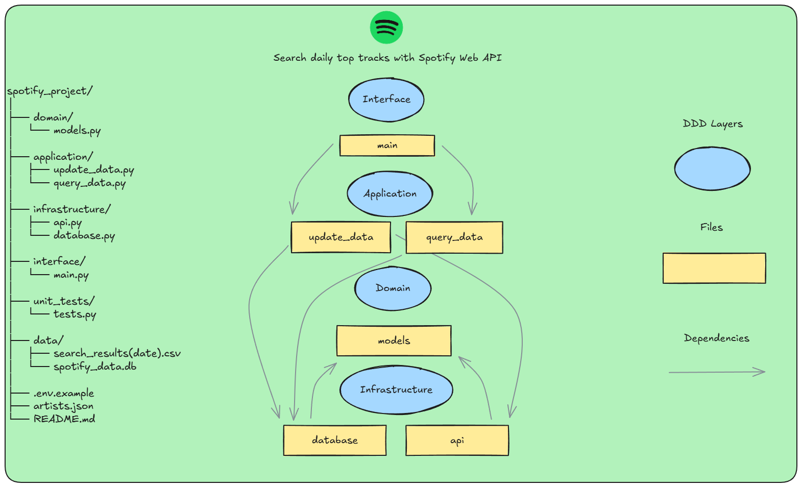

# Spotify Top Tracks CLI

This project performs data collection, updating, and querying of artists and their top tracks from Spotify, saving results to SQLite database (via SQLAlchemy ORM) and CSV files. Queries can be made by artist name or ID, returning the most popular songs from the most recent day.

## Features

- Automatic search and data updating of artists via Spotify API.
- Data storage in SQLite database using SQLAlchemy ORM and CSV files.
- Query artists and their top tracks by name or ID (case-insensitive), ordered by popularity.
- Structured JSON return format, ready for API usage or analysis.

## Project Architecture



## Prerequisites

- Python 3.10+
- [Spotify Developer Account](https://developer.spotify.com/) to obtain Client ID and Secret
- Install dependencies:
  ```sh
  pip install sqlalchemy requests python-dotenv coverage
  ```

## Setup

1. **Environment variables:**  
   Copy `.env.example` to `.env` and fill in your Spotify credentials:
   
   ```sh
   cp .env.example .env
   ```
   
   Edit `.env` file:
   ```env
   spotify_client_id=your_spotify_client_id_here
   spotify_client_secret=your_spotify_client_secret_here
   ```

2. **Artists file:**  
   Edit the `artists.json` file with the names of the artists you want to search.

## How to Use

### Update and query data

Run the command below to update data and query artists:

```sh
python -m interface.main --artists_json artists.json --filter "Linkin Park,System Of A Down"
```

- The `--filter` parameter accepts artist names or IDs, separated by comma.
- If you don't provide the filter, it will be requested via input.

### Query existing data only

To query existing data without updating from Spotify API:

```sh
python -m interface.main --filter "Linkin Park"
```

This will use data already stored in the database.

### Alternative: Pass credentials via CLI

You can also pass Spotify credentials directly via command line:

```sh
python -m interface.main --id YOUR_CLIENT_ID --secret YOUR_CLIENT_SECRET --artists_json artists.json
```

**Note:** Using `.env` file is recommended for security.

### Example response

The songs returned in `top_tracks` are ordered from most popular to least popular, according to Spotify popularity.

```json
{
  "Linkin Park": {
    "id": "6XyY86QOPPrYVGvF9ch6wz",
    "top_tracks": [
      {
        "song_name": "In the End",
        "song_id": "60a0Rd6pjrkxjPbaKzXjfq",
        "popularity": 92,
        "album": "Hybrid Theory (Bonus Edition)",
        "insertion_date": "2025-07-17 09:09:44.331729"
      }
    ]
  },
  "Disturbed": {
    "id": "3TOqt5oJwL9BE2NG9MEwDa",
    "top_tracks": [
      {
        "song_name": "Down with the Sickness",
        "song_id": "0WqIKmW4BTrj3eJFmnCKMv",
        "popularity": 88,
        "album": "The Sickness",
        "insertion_date": "2025-07-17 09:09:44.331729"
      }
    ]
  }
}
```

## Tests

### Running unit tests

To run all tests:

```sh
python -m unittest unit_tests.tests
```

### Test coverage

To check test coverage and generate an HTML report:

```sh
python -m coverage run -m unittest unit_tests.tests
python -m coverage html
start htmlcov/index.html
```

The report will be available at `htmlcov/index.html`.  
Open this file in your browser to view test coverage.

## Notes

- Data is saved in `/data/spotify_data.db` (using SQLAlchemy ORM) and CSV files in the `/data` folder.
- The project follows good practices for layer separation (infrastructure, domain, application, and interface).
- Tests use mocks to simulate API calls, file manipulation, and database operations, ensuring speed and reliability.
